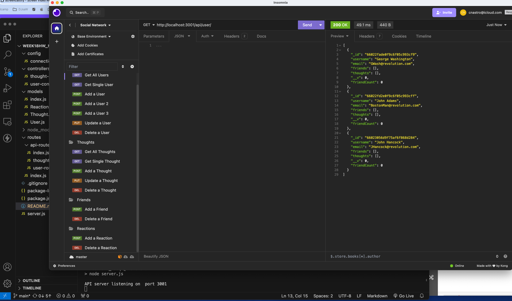

# 18 NoSQL: Social Network API

### Table of Contents
- [Overview](#Overview)
- [User Story](#User-Story)
- [Acceptance Criteria](#Acceptance-Criteria)
- [Screenshot](#Screenshot)
- [Submission](#Submission)

## Overview

Welcome to a Social Network API for our Founding Fathers! Users can add/delete their own thoughts as well as reactions to each other's posts and friends list!

## User Story

```md
AS A social media startup
I WANT an API for my social network that uses a NoSQL database
SO THAT my website can handle large amounts of unstructured data
```

## Acceptance Criteria

```md
GIVEN a social network API
WHEN I enter the command to invoke the application
THEN my server is started and the Mongoose models are synced to the MongoDB database
WHEN I open API GET routes in Insomnia for users and thoughts
THEN the data for each of these routes is displayed in a formatted JSON
WHEN I test API POST, PUT, and DELETE routes in Insomnia
THEN I am able to successfully create, update, and delete users and thoughts in my database
WHEN I test API POST and DELETE routes in Insomnia
THEN I am able to successfully create and delete reactions to thoughts and add and remove friends to a user’s friend list
```

## Screenshot



## Submission

* [Video Submission](https://drive.google.com/file/d/1emaLPym7oDtyenJdtNWerAxOxUiPN0Dw/view)

* [GitHub Repo](https://github.com/chrisnastro/week18hw_NoSQL)
---
© 2024 edX Boot Camps LLC. Confidential and Proprietary. All Rights Reserved.
